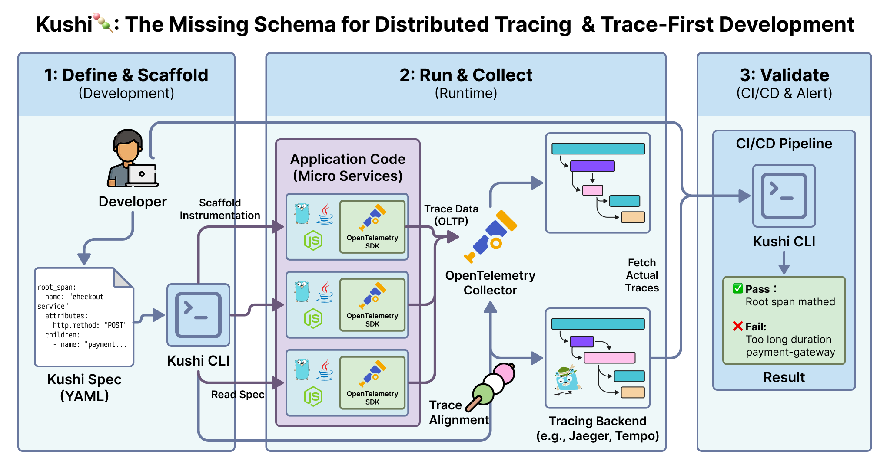

# Kushi 🍡 - The missing schema for Distributed Tracing

**Start "Trace-First Development" today.**

[](https://opensource.org/licenses/MIT)
[](https://opentelemetry.io/)

---
This project is currently in the idea / prototype stage.



### 💡 The Problem

You wouldn't build a REST API without **OpenAPI (Swagger)**.
So why are you building Distributed Systems without a **Trace Schema**?

Currently, developers implement OpenTelemetry instrumentation blindly and only verify the trace *after* deployment. This leads to:

- ❌ Broken span relationships.
- ❌ Missing critical attributes.
- ❌ "Spaghetti traces" that offer no observability value.

### 🚀 The Solution

**Kushi** brings **Telemetry-Driven Development (TDD)** to your workflow.
Define the *expected shape* of your trace before you write a single line of code.

1.  **Define** your trace expectations in a declarative YAML.
2.  **Scaffold** your instrumentation code automatically.
3.  **Validate** your actual traces against the spec in CI/CD.

### ⚡️ Quick Look

**1. Define the spec (`checkout-flow.yaml`)**

```yaml
spec_version: "0.1.0"
root_span:
  name: "checkout-service"
  attributes:
    http.method: "POST"
  children:
    - name: "payment-gateway"
      required: true
      max_duration: "500ms" # Performance budget as code! 
    - name: "inventory-update"
      attributes:
        db.system: "postgresql"
```

### Validate in CI

```
$ kushi validate remote ./checkout-flow.yaml \ 
 --endpoint localhost:4317 \
 --protocol otlphttp

$ kushi validate remote ./checkout-flow.yaml \
  --endpoint http://collector:4318 \
  --jaeger http://jaeger:16686

✅ Root span "checkout-service" matched.
✅ Child span "payment-gateway" found.
❌ Error: Child span "inventory-update" missing attribute "db.system".

```

## Contributing

Kushi is currently in an early experimental phase.  
Contributions, ideas, and discussions are very welcome!

If you'd like to help:

1. Open an Issue to propose ideas or report problems  
2. Submit a Pull Request for documentation, examples, or initial implementation  
3. Join the discussion in the Issues tab  

More detailed contribution guidelines will be added as the project evolves.

### 🍡 Why “Kushi”?

Like a Japanese kushi (skewer), this tool pierces through your microservices, keeping your traces aligned, structured, and deliciously debuggable.
